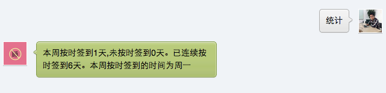

#我要早起(@51zaoqi)能帮助你做什么
我要早起是一款可以激励你早起的应用，您在使用我要早起之后，需要在每天早起之后对我要早起进行
签到，我要早起会帮助您统计您的早起信息，方便您自我督促，自我管理。并且我要早起会将您每天早
晨的签到信息实时同步到新浪微博帐号(51zaoqi)上，方便大家互相督促，互相提高。

#什么是“我要早起”
我要早起就是一个微信公众帐号，用户可以通过搜索'izaoqi'进行关注,或者直接扫二维码

;

#使用方法
1. 首先，您需要关注“我要早起”微信帐号，您可以通过搜索'izaoqi'即可关注，或者扫描下面的二维
码。

2. 根据您自己的需求（是要6点起还是7点起)，进行注册，只要发送'注册6点#您的昵称'或'注册7点#
您得昵称'进行注册即可。注册成功后，您就可以在相应的时间点进行签到了,发送'早'即可签到,签到
后会给你返回签到名词等信息，并返回给您一首歌曲，您可以点击立即播放，用于帮您提神

3. 设置您得新浪微博帐号（如果您刚注册的昵称与您的微博昵称一样，则可跳过这一步），您可以通过发送
'新浪微博#微博昵称'进行设置，设置好后，每天您的签到信息同步到51zaoqi微博时，会自动@您。（
该步可选）

4. 发送'统计',可以查询您的签到信息，包括本周签到几天，未签到几天，连续签到几天等。

5. 发送'结果',可以查询您所在组的同学的签到情况。包括按时签到的朋友，和非按时签到的朋友 

下面是几张截图:
##签到功能(现在签到功能已经升级，每当签到时，会随机返回一首歌曲，用于帮您提神)
;
##统计功能

##微博同步

##注册功能
;

**欢迎大家使用，从今天起，让我们一起做一个晨型人**

愿与您交流: neu.loner@gmail.com
